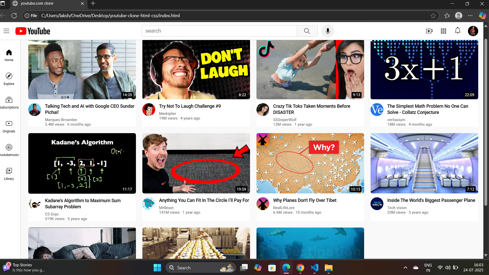

# 📺 YouTube Clone (HTML & CSS)

A simple static clone of the YouTube homepage built using only HTML and CSS. This project is designed to replicate the layout and design of the original YouTube front-end, helping beginners understand how real-world UIs are structured and styled.

 <!-- Replace with actual image path if available -->

## 🔧 Features

- ✅ Responsive navigation bar with logo, search bar, and user icons  
- ✅ Sidebar with navigation items (Home, Trending, Subscriptions, etc.)  
- ✅ Video card layout with thumbnails, titles, channel name, and metadata  
- ✅ Responsive grid using Flexbox and CSS Grid  
- ✅ Clean and semantic HTML structure  
- ✅ Modern, mobile-friendly styling with media queries

